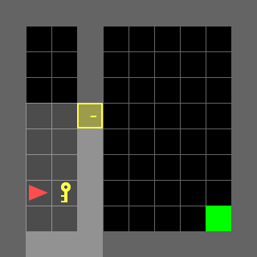
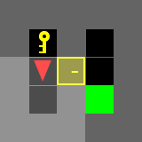
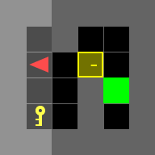
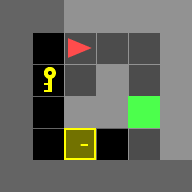
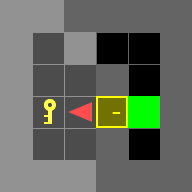
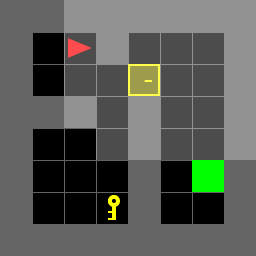
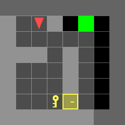
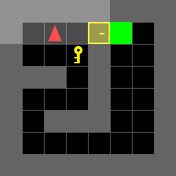

# ECE276B SP25 Project 1

## Overview
In this assignment, you are required to implement dynamic programming for the Door-Key problems.
<p align="center">
</br>
</p>

There are 7 test scenes you have to test and include in the report.

|           doorkey-5x5-normal            |
| :-------------------------------------: |
|  |

|           doorkey-6x6-normal            |            doorkey-6x6-direct            |            doorkey-6x6-shortcut            |
| :-------------------------------------: | :--------------------------------------: | :----------------------------------------: |
|  |  |  |

|           doorkey-8x8-normal            |            doorkey-8x8-direct            |            doorkey-8x8-shortcut            |
| :-------------------------------------: | :--------------------------------------: | :----------------------------------------: |
|  |  |  |

## Installation

- Install Python version `3.8 ~ 3.12`
- Install dependencies
```bash
pip install -r requirements.txt
```

## Instruction
### 1. doorkey.py
You will need to modify **doorkey.py** as the main entrance.

### 2. utils.py
You might find some useful tools in utils.py
- **step()**: Move your agent
- **generate_random_env()**: Generate a random environment for debugging
- **load_env()**: Load the test environments
- **save_env()**: Save the environment for reproducing results
- **plot_env()**: For a quick visualization of your current env, including: agent, key, door, and the goal
- **draw_gif_from_seq()**: Draw and save a gif image from a given action sequence.

### 3. example.py
The example.py shows you how to interact with the utilities in utils.py, and also gives you some examples of interacting with gym-minigrid directly.

---
# Implementation

## 1. known_env.py
The known_env.py is the implementation of DP that solve the known map problem. 

## 2.uknown_env.py
The uknown_env.py contains implementation of both
- DP to compute a single policy dict for all unkown map
- Query action sequence given pre-computed policy dict and env of given unknown map  

The precomputed policy and value dict are stored at **/output/unknown_sol.npz**

## 3. doorkey.py
Run doorkey.py to check result, which has following functions
- **doorkey_problem()**: compute optimal action sequence, plot trajectory and output gif
- **partA()**: run this function for **known map** problem
  - It will take path to .env of known map as input
- **partB()**: run this function for **unkown map** problem
  - It will take path to folder of unknown map as input
  - It will only load random map per run

Output trajectory will be stored in **/traj**, output gif will be stored in **/gif**.

### Note
Unfortunately, due to the large state space, the precomputed policy and value dict are too large. I couldn't include them
in submission. Therefore, when running **partB()** for the first time, it would take some times to compute policy dict and state dict.
After the first time, it would be able to use precomputed policy and value dict to query action sequence.

Also, numpy in my local environment couldn't load the original .env file in the project package. All .env files in /env folder are re-created .env file applying the
create_env.py with python packages of my local environment. If running my submission results in errors related to loading the .env files, please try re-generating them using create_env.py to ensure compatibility with your current environment. 